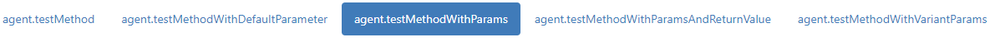

# QJsonChannel UI Forms 

This example shows how to generate UI forms for RPC functions exposed by the QJsonChannel server.
The example utilizes the [JSON Schema Service Descriptor](https://jsonrpc.org/historical/json-schema-service-descriptor.html) format for discovering service list on a specific QJsonChannel server and uses the [React Jon Schema Form](https://github.com/mozilla-services/react-jsonschema-form) for the UI forms generation. A generated UI Form allows specifying parameter values and invokes a server-side method using QJsonChannel.

## Example running
For the example running you need to do the regular React stuff:
~~~~~shell
npm install
npm start
~~~~~
For build:
~~~~~shell
npm run build
~~~~~

## How it works
1. At the first step, QJsonChannel UI Forms send a __init__ request to QJsonChannel server and receives a response in JSON Schema Service Descriptor format. For example:
~~~~json
{
  "agent": {
    "info": {
      "title": "Service",
      "version": "1.0"
    },
    "jsonrpc": "2.0",
    "methods": {
      "testMethod": {
        "description": "testMethod",
        "params": {
          "properties": {},
          "type": "object"
        },
        "result": {
          "description": "return value",
          "type": "undefined"
        },
        "summary": "testMethod"
      },
      "testMethodWithDefaultParameter": {
        "description": "testMethodWithDefaultParameter",
        "params": {
          "properties": {
            "first": {
              "description": "first",
              "type": "string"
            }
          },
          "type": "object"
        },
        "result": {
          "description": "return value",
          "type": "undefined"
        },
        "summary": "testMethodWithDefaultParameter"
      },
      "testMethodWithParams": {
        "description": "testMethodWithParams",
        "params": {
          "properties": {
            "first": {
              "description": "first",
              "type": "string"
            },
            "second": {
              "description": "second",
              "type": "boolean"
            },
            "third": {
              "description": "third",
              "type": "number"
            }
          },
          "type": "object"
        },
        "result": {
          "description": "return value",
          "type": "undefined"
        },
        "summary": "testMethodWithParams"
      },
      "testMethodWithParamsAndReturnValue": {
        "description": "testMethodWithParamsAndReturnValue",
        "params": {
          "properties": {
            "name": {
              "description": "name",
              "type": "string"
            }
          },
          "type": "object"
        },
        "result": {
          "description": "return value",
          "type": "string"
        },
        "summary": "testMethodWithParamsAndReturnValue"
      },
      "testMethodWithVariantParams": {
        "description": "testMethodWithVariantParams",
        "params": {
          "properties": {
            "first": {
              "description": "first",
              "type": "string"
            },
            "fourth": {
              "description": "fourth",
              "type": "undefined"
            },
            "second": {
              "description": "second",
              "type": "boolean"
            },
            "third": {
              "description": "third",
              "type": "number"
            }
          },
          "type": "object"
        },
        "result": {
          "description": "return value",
          "type": "undefined"
        },
        "summary": "testMethodWithVariantParams"
      }
    }
  }
}
~~~~

2. Based on Service Descriptor, QJsonChannel UI Forms generates a list of services.methods available for RPC calls.

3. Each one of methods (service function) is described using JSON Schema document:
~~~~
 "testMethodWithParams": {
        "description": "testMethodWithParams",
        "params": {
          "properties": {
            "first": {
              "description": "first",
              "type": "string"
            },
            "second": {
              "description": "second",
              "type": "boolean"
            },
            "third": {
              "description": "third",
              "type": "number"
            }
          },
          "type": "object"
        },
        "result": {
          "description": "return value",
          "type": "undefined"
        },
        "summary": "testMethodWithParams"
      }
~~~~

The current PRC method can be chosen using the Selector buttons. A react form will be automatically generated for a current PRC method:

4. A submit button initiates a RPC call of a selected method using specified parameters/

## References
- [React JSon Schema Form](https://github.com/mozilla-services/react-jsonschema-form) A React component for building Web forms from JSON Schema.
- [simple-jsonrpc-js](https://github.com/jershell/simple-jsonrpc-js) - Simple JSON-RPC javascript library. Generate and parse json rpc messages
- [JSON-RPC](http://jsonrpc.org/) is lightweight remote procedure call protocol similar to XML-RPC.
- [JSON Schema Service Descriptor](https://jsonrpc.org/historical/json-schema-service-descriptor.html)
